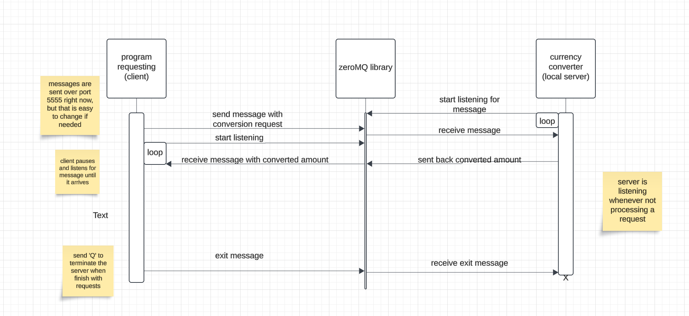

# CS361_currency_converter

## REQUEST data
Use a Zeromq client to send a request to the local server on port 5555.   
Request should be sent as a string with variable name and value seperated by a colon: 
<pre>
    amount:FLOAT                                    - single value to convert  
    amount_list:str(LIST)                           - list of values to convert  
    from_currency:(EUR|CAD|USD)                     - current currency  
    to_currency: (EUR|CAD|USD)                      - desired currency  
</pre>

Message should only have either amount or amount_list, but not both  
from_currency is optional and will default to USD

EX: "amount:100.30 from_currency:CAD to_currency:USD"
    or "amount:[102.44, 200, 302.3, 10.99] to_currency:CAD"

```
context = zmq.Context()
socket = context.socket(zmq.REQ)
socket.connect("tcp://localhost:5555")
socket.send_string("amount:100.30 to_currency:EUR")
```

## RECEIVE data
Start listening to receive a string containing the converted value imediately after requesting

```
reply_str = socket.recv()
converted_amount = float(reply_str)
```

## UML sequence diagram



## Communication contract
For which teammate did you implement Microservice A?    
    - Dylan Allen

What is the current status of the microservice?  
    - Finished

If the microservice isn't done, which parts aren't done and when will they be done?  
    - N/A

How is your teammate going to access youir microservice?   
    - download from github and run locally  
    - link: https://github.com/MeTypeCode/CS361_currency_converter

If your teammate cannot access/call YOUR microservice, what should they do?  
    - Let me know on discord. I should be able to respond within the day (probably within the hour)

If your teammate cannot access/call your microservice, by when do they need to tell you?  
    - At least 24 hours before they need to use it.

Is there anything else your teammate needs to know?  
    - I realized once I finished it and was testing that currency conversion rates change pretty frequently, so it may not be 100% accurate without updated conversion rates. 
